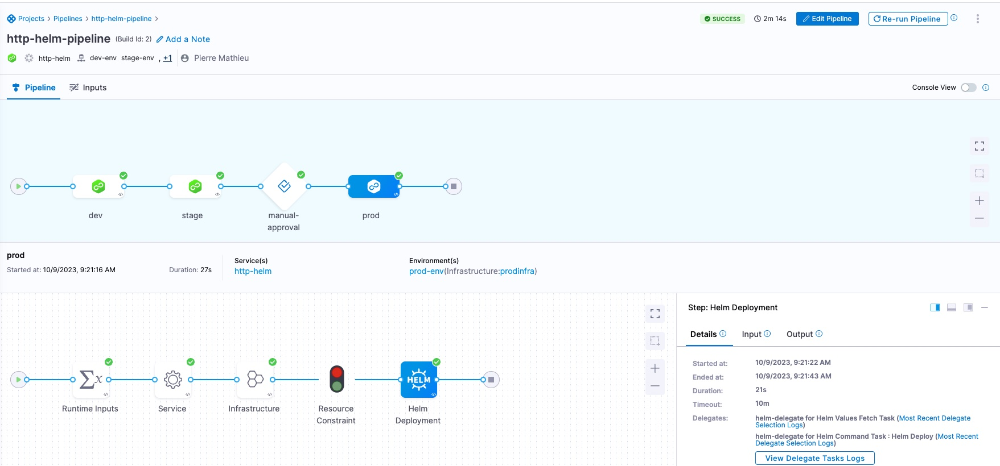

# Kubernetes DevOps Pipeline Setup using Harness CLI

This README provides a comprehensive guide for setting up a Kubernetes DevOps pipeline using Helm and Harness using Harness CLI. The provided script automates essential tasks such as namespace creation, environment variable setup, Helm chart installation, and configuration of various components to establish an efficient pipeline.



## Prerequisites

Before proceeding with the script, ensure you have the following prerequisites ready:

- **kubectl**: Ensure you have [kubectl](https://kubernetes.io/docs/tasks/tools/install-kubectl/) installed and properly configured.

- **Helm**: Install [Helm](https://helm.sh/docs/intro/install/) on your system.

- **Harness Account**: You must have a Harness account with the necessary API and delegate tokens.

- **GitHub Personal Access Token (PAT)**: Obtain a [GitHub Personal Access Token (PAT)](https://docs.github.com/en/authentication/authenticating-to-github/creating-a-personal-access-token) to access GitHub resources. This token is crucial for integrating with GitHub.

## Installation Steps

Follow the steps below to set up your Kubernetes DevOps pipeline:

0. **Kubernetes Context**:

   Switch to the Docker Desktop Kubernetes context using the following command:

   ```bash
   kubectl config use-context docker-desktop
   kubectl get nodes

1. **Namespace Creation**:

    Create three separate namespaces for different environments: dev, stage, and prod:

    ``` bash
    kubectl create namespace dev
    kubectl create namespace stage
    kubectl create namespace prod

2. **Namespace Verification:**:

    Ensure the successful creation of the namespaces by running the following command:

    ``` bash
    kubectl get namespace dev stage prod


3. **Environment Variables:**:
    
    Set the required environment variables for your Git user, Harness Account ID, Harness API token, and Harness Delegate token. Replace the placeholders with your actual values.
    
    ``` bash
    echo 'export GIT_USER="*****GIT_USERNAME NEEDED HERE*******"' >> ~/.bash_profile
    echo 'export HARNESS_ACCOUNT_ID="*****ACCOUNT_ID NEEDED HERE*******"' >> ~/.bash_profile
    echo 'export HARNESS_API_TOKEN="*********API TOKEN NEEDED HERE**********"' >> ~/.bash_profile
    echo 'export HARNESS_DELEGATE_TOKEN="**********DELEGATE TOKEN NEEDED HERE***************"' >> ~/.bash_profile
    source ~/.bash_profile


4. **Harness Helm Chart Repository:**:

    Add the Harness Helm chart repository to your local Helm registry and update it:
    
    ``` bash
    helm repo add harness-delegate https://app.harness.io/storage/harness-download/delegate-helm-chart/
    helm repo update harness-delegate


5. **Harness Delegate Installation:**:

    Install the Harness Delegate in the "dev" namespace, providing necessary configurations.

    ``` bash
    helm upgrade -i helm-delegate --namespace dev \
    harness-delegate/harness-delegate-ng \
    --set delegateName=helm-delegate \
    --set accountId=$HARNESS_ACCOUNT_ID \
    --set delegateToken=$HARNESS_DELEGATE_TOKEN \
    --set managerEndpoint=https://app.harness.io \
    --set delegateDockerImage=harness/delegate:23.09.80505 \
    --set replicas=1 --set upgrader.enabled=false


6. **Harness CLI Download:**:

    Download the Harness CLI and add it to your PATH:
    
    ``` bash
    curl -LO https://github.com/harness/harness-cli/releases/download/v0.0.15-Preview/harness-v0.0.15-Preview-darwin-amd64.tar.gz
    tar -xvf harness-v0.0.15-Preview-darwin-amd64.tar.gz
    export PATH="$(pwd):$PATH"
    echo 'export PATH="'$(pwd)':$PATH"' >> ~/.bash_profile


7. **Harness CLI Login:**:

    Log in to the Harness CLI using your API key and account ID:

    ``` bash
    harness login --api-key $HARNESS_API_TOKEN --account-id $HARNESS_ACCOUNT_ID


8. **GitHub PAT Secret:**:

    Create a secret in Harness for the GitHub Personal Access Token (PAT):

    ``` bash
    harness secret --token $HARNESS_API_TOKEN

**the pipeline directory content**
    pipeline/github-connector.yml


9. **GitHub Connector:**:

    Create a GitHub Connector to access GitHub YAML files:

    ``` bash
    harness connector --file pipeline/github-connector.yml apply --git-user $GIT_USER


10. **Kubernetes Cluster Connector:**:

    Create a Kubernetes Cluster Connector using the Helm Delegate created earlier, in step 5:

    ``` bash
    harness connector --file pipeline/kubernetes-connector.yml apply --delegate-name helm-delegate


11. **Docker Connection:**:
    Create a Docker Connector to access and pull docker images:

    ``` bash
    harness connector --file pipeline/docker-connector.yml apply


12. **Service Creation:**:

    Create the nginx Service from helm chart: nginx/helm and artifact:  docker.io/bitnami/nginx:latest from docker:
    
    ``` bash
    harness service --file pipeline/k8s-service.yml apply


13. **Environment Creation:**:

    Create Environments to represent different infrastructure stages (dev, stage, prod): 
    
    ``` bash
    harness environment --file pipeline/k8s-dev-environment.yml apply
    harness environment --file pipeline/k8s-stage-environment.yml apply
    harness environment --file pipeline/k8s-prod-environment.yml apply


14. **Infrastructure Definitions:**:

    Create Infrastructure Definitions to specify the target clusters for the infrastructure associated with the namespaces (dev, stage, prod):
    
    ``` bash
    harness infrastructure --file pipeline/k8s-dev-infrastructure-definition.yml apply
    harness infrastructure --file pipeline/k8s-stage-infrastructure-definition.yml apply
    harness infrastructure --file pipeline/k8s-prod-infrastructure-definition.yml apply


15. **Pipeline Setup:**:

    Create the pipeline for your Kubernetes application:
    
    ``` bash
    harness service --file pipeline/k8s-http-helm-service.yml apply
